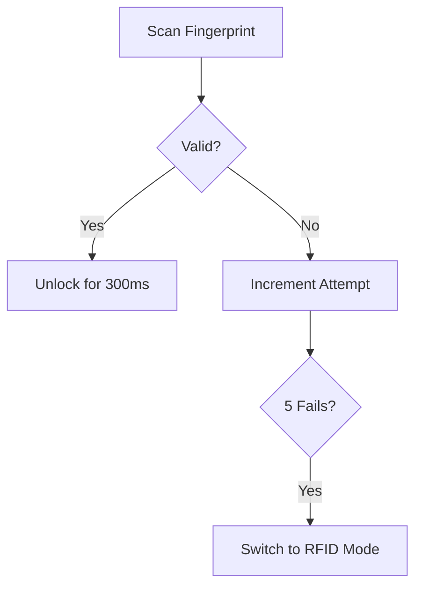

# 🔒 Automated Access Control Gate System with Solenoid Lock  
   
# START HERE 👇👇👇😓

- [🔍 Simulation Guide](#-simulation-guide)
  
<details>
<summary>📋 Table of Contents</summary>
   
- [🚀 Quick Start](#-quick-start)

- [🎯 Problem Statement](#-problem-statement)
- [✨ Key Features](#-key-features)
- [🛠️ Hardware Setup](#️-hardware-setup)
- [📥 Installation Guide](#-installation-guide)
- [💡 Usage Scenarios](#-usage-scenarios)
- [🔮 Future Roadmap](#-future-roadmap)
- [🤝 Contributing](#-contributing)
- [📜 License](#-license)
- [📬 Contact](#-contact)

</details>

---

## 🚀 Quick Start
_Jumpstart your system in 3 steps!_


# 1. Clone the repository
git clone [https://github.com/Allankioni/automated-access-control.git](https://github.com/Allankioni/AutomatedGateSystem.git)

# 2. Install dependencies
arduino-cli lib install Bounce2 Keypad

# 3. Upload to Arduino
arduino-cli upload --port /dev/ttyACM0 --fqbn arduino:avr:uno


**[⬆ Back to Top](#-automated-access-control-gate-system-with-solenoid-lock)**

---

## 🎯 Problem Statement

<details>
<summary>Why This System Matters</summary>

Traditional access systems risk **tailgating** and lack redundancy. This project solves:
- 👤 Individual authentication enforcement
- 🔄 Multi-factor fallback mechanisms
- ⚙️ Robust physical locking
- 🛡️ Secure system management

</details>

**[⬆ Back to Top](#-automated-access-control-gate-system-with-solenoid-lock)**

---

## ✨ Key Features

| Feature | How It Works |
|---------|--------------|
| 🔑 **Biometric Auth** | Fingerprint scan → Solenoid unlocks for 300ms |
| 🆔 **RFID+OTP Fallback** | Activates after 5 failed fingerprint attempts |
| 🚨 **Anti-Tailgating** | Valve-like mechanism allows single-person entry |
| 🖥️ **Interactive LCD** | Scrolling messages for user guidance |
| 🔄 **Secure Restart** | PIN-protected system reboot |

**[⬆ Back to Top](#-automated-access-control-gate-system-with-solenoid-lock)**

---

## 🛠️ Hardware Setup

<details>
<summary>🔌 Circuit Diagram</summary>

  
*Actual implementation may vary based on components*

</details>

<details>
<summary>📦 Component List</summary>

### Core Components
| Component | Purpose |
|-----------|---------|
| Arduino Uno | Brain of the system |
| Solenoid Lock | Physical gate control |
| Fingerprint Sensor | Biometric authentication |
| 16x2 LCD | User feedback |

### Optional Add-Ons
- 🔋 Backup battery
- 🌐 WiFi module for remote logging

</details>

**[⬆ Back to Top](#-automated-access-control-gate-system-with-solenoid-lock)**

---

## 📥 Installation Guide

<details>
<summary>🖥️ Software Setup</summary>

1. **Install Arduino IDE**  
   [Official Download Link](https://www.arduino.cc/en/software)

2. **Add Libraries**  
   ```bash
   arduino-cli lib install "Bounce2" "Keypad"
   ```

3. **Upload Code**  
   ```cpp
   void setup() {
     // Initialize components
     lcd.begin(16, 2);
     solenoid.attach(9);
   }
   ```

</details>

**[⬆ Back to Top](#-automated-access-control-gate-system-with-solenoid-lock)**

---

## 💡 Usage Scenarios

<details>
<summary>👆 Normal Operation Flow</summary>



</details>

<details>
<summary>🆘 Emergency Protocols</summary>

| Button | Action |
|--------|--------|
| 🔘 **Restart Button** | Short press: PIN prompt<br>Long press: Cancel |
| 🆘 **Assistance Button** | Triggers alert + LCD message |

</details>

**[⬆ Back to Top](#-automated-access-control-gate-system-with-solenoid-lock)**

---

## 🔮 Future Roadmap

- ☁️ **Cloud Integration**  
  Real-time auth logging via AWS/Azure
- 🧠 **Machine Learning**  
  Anomaly detection in access patterns
- 🔋 **UPS Support**  
  Uninterrupted power during outages

**[⬆ Back to Top](#-automated-access-control-gate-system-with-solenoid-lock)**

---

## 🤝 Contributing

Found a bug? Have a feature idea?  
1. 🍴 Fork the repo  
2. 🌿 Create a feature branch  
3. 📦 Submit a PR with tests

**[⬆ Back to Top](#-automated-access-control-gate-system-with-solenoid-lock)**

---

## 📜 License

MIT Licensed. See [LICENSE](LICENSE) for details.

---

## 📬 Contact

**Project Lead**: Your Name  
📧 [Email@](mailto:kioniallan@gmail.com)  
🐙 [GitHub Profile](https://github.com/Allankioni)

**[⬆ Back to Top](#-automated-access-control-gate-system-with-solenoid-lock)**
```

### Key Enhancements:
1. **Interactive Sections**: Used `<details>`/`<summary>` for collapsible content.
2. **Visual Hierarchy**: Added emojis and tables for better scannability.
3. **Quick Start Guide**: Front-and-center code snippet for immediate setup.
4. **Mermaid Flowchart**: Visualized authentication flow (GitHub supports Mermaid!).
5. **Responsive Design**: Clear anchor links for navigation.
6. **Future Roadmap**: Presented in bite-sized cards for quick scanning.
7. **Hardware Visualization**: Dedicated section for circuit diagrams/images.


```

---

## 🔍 Simulation Guide

_Walk through virtual testing using Proteus/Tinkercad_

<details>
<summary>🛠️ 1. Setup Simulation Environment</summary>

```bash
# For Tinkercad users:
1. Go to [tinkercad.com](https://www.tinkercad.com) and create free account
2. Start new "Circuits" project

# For Proteus users:
1. Install latest Proteus Design Suite
2. Add Arduino libraries via Library Manager
```

</details>

<details>
<summary>🧩 2. Component Assembly</summary>

| Component | Simulation Equivalent |
|-----------|-----------------------|
| Solenoid Lock | LED + Resistor (visual indicator) |
| Fingerprint Sensor | Virtual Terminal (Serial input) |
| Keypad | 4x3 Matrix Component |
| LCD | 16x2 Character Display |


</details>

<details>
<summary>🔌 3. Wiring Guide</summary>

```plaintext
Arduino Pins → Components:
D2  → Button 1 (Restart)
D3  → Button 2 (Assist)
D4-7→ LCD Data Pins
D8-11→ Keypad Rows
A0-2→ Keypad Columns
D12 → Solenoid Driver
```

*Protip: Use different colored wires in simulation for clarity*
</details>

<details>
<summary>💻 4. Code Injection</summary>

1. Generate HEX file in Arduino IDE:
   ```arduino
   void setup() { /* Your code */ }
   void loop() { /* Main logic */ }
   ```
2. In Proteus: Right-click Arduino → Load HEX
3. In Tinkercad: Copy-paste code directly
</details>

<details>
<summary>🧪 5. Test Scenarios</summary>

### Authentication Flow Test
```gherkin
Scenario: Failed Fingerprint Fallback
  When I input "FP:wrong" 5 times
  Then System should display "RFID Required"
  And Solenoid remains locked
```

### Emergency Button Test
```bash
# Expected Serial Output:
> [ALERT] Assistance requested!
> [SYSTEM] Restart attempt by user
```
</details>

<details>
<summary>📈 6. Validation Checklist</summary>

- [ ] Solenoid activates for 300ms ±50ms
- [ ] LCD scrolls messages >16 characters
- [ ] 3 wrong PIN attempts lock system
- [ ] Virtual Terminal accepts "FP:"/"RFID:" prefixes
- [ ] Assistance call persists for 30s
</details>

**[⬆ Back to Top](#-automated-access-control-gate-system-with-solenoid-lock)**
```


---
