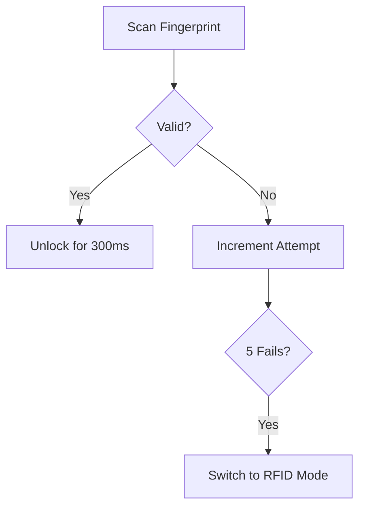

# 🔒 Automated Access Control Gate System with Solenoid Lock  

- [Steps to Work Through the Simulation](#-steps-to-work-through-the-simulations)
  
<details>
<summary>📋 Table of Contents</summary>
   
- [🚀 Quick Start](#-quick-start)

- [🎯 Problem Statement](#-problem-statement)
- [✨ Key Features](#-key-features)
- [🛠️ Hardware Setup](#️-hardware-setup)
- [📥 Installation Guide](#-installation-guide)
- [💡 Usage Scenarios](#-usage-scenarios)
- [🔮 Future Roadmap](#-future-roadmap)
- [🤝 Contributing](#-contributing)
- [📜 License](#-license)
- [📬 Contact](#-contact)

</details>

---

## 🚀 Quick Start
_Jumpstart your system in 3 steps!_


# 1. Clone the repository
git clone https://github.com/yourusername/automated-access-control.git

# 2. Install dependencies
arduino-cli lib install Bounce2 Keypad

# 3. Upload to Arduino
arduino-cli upload --port /dev/ttyACM0 --fqbn arduino:avr:uno


**[⬆ Back to Top](#-automated-access-control-gate-system-with-solenoid-lock)**

---

## 🎯 Problem Statement

<details>
<summary>Why This System Matters</summary>

Traditional access systems risk **tailgating** and lack redundancy. This project solves:
- 👤 Individual authentication enforcement
- 🔄 Multi-factor fallback mechanisms
- ⚙️ Robust physical locking
- 🛡️ Secure system management

</details>

**[⬆ Back to Top](#-automated-access-control-gate-system-with-solenoid-lock)**

---

## ✨ Key Features

| Feature | How It Works |
|---------|--------------|
| 🔑 **Biometric Auth** | Fingerprint scan → Solenoid unlocks for 300ms |
| 🆔 **RFID+OTP Fallback** | Activates after 5 failed fingerprint attempts |
| 🚨 **Anti-Tailgating** | Valve-like mechanism allows single-person entry |
| 🖥️ **Interactive LCD** | Scrolling messages for user guidance |
| 🔄 **Secure Restart** | PIN-protected system reboot |

**[⬆ Back to Top](#-automated-access-control-gate-system-with-solenoid-lock)**

---

## 🛠️ Hardware Setup

<details>
<summary>🔌 Circuit Diagram</summary>

  
*Actual implementation may vary based on components*

</details>

<details>
<summary>📦 Component List</summary>

### Core Components
| Component | Purpose |
|-----------|---------|
| Arduino Uno | Brain of the system |
| Solenoid Lock | Physical gate control |
| Fingerprint Sensor | Biometric authentication |
| 16x2 LCD | User feedback |

### Optional Add-Ons
- 🔋 Backup battery
- 🌐 WiFi module for remote logging

</details>

**[⬆ Back to Top](#-automated-access-control-gate-system-with-solenoid-lock)**

---

## 📥 Installation Guide

<details>
<summary>🖥️ Software Setup</summary>

1. **Install Arduino IDE**  
   [Official Download Link](https://www.arduino.cc/en/software)

2. **Add Libraries**  
   ```bash
   arduino-cli lib install "Bounce2" "Keypad"
   ```

3. **Upload Code**  
   ```cpp
   void setup() {
     // Initialize components
     lcd.begin(16, 2);
     solenoid.attach(9);
   }
   ```

</details>

**[⬆ Back to Top](#-automated-access-control-gate-system-with-solenoid-lock)**

---

## 💡 Usage Scenarios

<details>
<summary>👆 Normal Operation Flow</summary>



</details>

<details>
<summary>🆘 Emergency Protocols</summary>

| Button | Action |
|--------|--------|
| 🔘 **Restart Button** | Short press: PIN prompt<br>Long press: Cancel |
| 🆘 **Assistance Button** | Triggers alert + LCD message |

</details>

**[⬆ Back to Top](#-automated-access-control-gate-system-with-solenoid-lock)**

---

## 🔮 Future Roadmap

- ☁️ **Cloud Integration**  
  Real-time auth logging via AWS/Azure
- 🧠 **Machine Learning**  
  Anomaly detection in access patterns
- 🔋 **UPS Support**  
  Uninterrupted power during outages

**[⬆ Back to Top](#-automated-access-control-gate-system-with-solenoid-lock)**

---

## 🤝 Contributing

Found a bug? Have a feature idea?  
1. 🍴 Fork the repo  
2. 🌿 Create a feature branch  
3. 📦 Submit a PR with tests

**[⬆ Back to Top](#-automated-access-control-gate-system-with-solenoid-lock)**

---

## 📜 License

MIT Licensed. See [LICENSE](LICENSE) for details.

---

## 📬 Contact

**Project Lead**: Your Name  
📧 [Email@](mailto:kioniallan@gmail.com)  
🐙 [GitHub Profile](https://github.com/Allankioni)

**[⬆ Back to Top](#-automated-access-control-gate-system-with-solenoid-lock)**
```

### Key Enhancements:
1. **Interactive Sections**: Used `<details>`/`<summary>` for collapsible content.
2. **Visual Hierarchy**: Added emojis and tables for better scannability.
3. **Quick Start Guide**: Front-and-center code snippet for immediate setup.
4. **Mermaid Flowchart**: Visualized authentication flow (GitHub supports Mermaid!).
5. **Responsive Design**: Clear anchor links for navigation.
6. **Future Roadmap**: Presented in bite-sized cards for quick scanning.
7. **Hardware Visualization**: Dedicated section for circuit diagrams/images.


```
---
## Steps to Work Through the Simulations


1. **Set Up Your Simulation Environment**
   - **Install Proteus/Tinkercad:**  
     Download and install your preferred simulation software. For Proteus, ensure you have the latest version; for Tinkercad, create an account if you haven't already.
   - **Add the Arduino Library:**  
     If using Proteus, make sure you have the Arduino UNO model and the necessary libraries (if available) installed. For Tinkercad, the Arduino components are usually preloaded.

2. **Import Components into Your Workspace**
   - **Place the Arduino UNO:**  
     Add the Arduino UNO board as your central controller.
   - **Add the LCD Display:**  
     Place a non-I2C 16×2 LCD and wire it according to the specified pins (RS, EN, D4–D7).
   - **Place the Keypad:**  
     Add a 4×3 matrix keypad and assign the row and column pins as defined.
   - **Include the Solenoid Lock (or its driver):**  
     For simulation, you can use a digital output to represent the solenoid lock activation.
   - **Add Push-Buttons:**  
     Place two push-buttons for Button 1 (restart) and Button 2 (assistance). Use virtual switches or push-button components.
   - **Virtual Terminal for Serial Input:**  
     Add a Virtual Terminal component to simulate fingerprint and RFID inputs (remember to prefix inputs with "FP:" or "RFID:" as required).
   - **Additional Components:**  
     Include any necessary wires, power sources, and the Bounce2 library if your simulation environment supports it.

3. **Wire the Components**
   - Follow the circuit diagram provided in your documentation:
     - Connect the LCD to the appropriate Arduino pins.
     - Wire the keypad rows and columns.
     - Connect the push-buttons to their designated pins with pull-up configurations.
     - Wire the solenoid lock driver circuit (or simulate it with a digital output).
     - Connect the Virtual Terminal to the Arduino’s Serial RX/TX pins for fingerprint and RFID simulation.

4. **Load the Compiled Code**
   - **Compile the Sketch:**  
     Open your `.ino` file in the Arduino IDE and compile it to generate a HEX file.
   - **Attach the HEX File:**  
     In Proteus (or your chosen simulation tool), load the HEX file into the Arduino UNO component properties.
   - **Ensure Proper Settings:**  
     Double-check that all component pin assignments match those specified in your code.

5. **Run the Simulation**
   - **Start the Simulation:**  
     Begin the simulation in your environment.
   - **Monitor Outputs:**  
     Observe the LCD display, the Virtual Terminal (Serial Monitor), and any indicators (like LED or solenoid lock status).

6. **Test the Authentication Process**
   - **Fingerprint Input:**  
     In the Virtual Terminal, send a fingerprint input by typing, for example, `FP:FP1` and press enter.  
     - If the fingerprint is valid (matches a user in your database), the LCD should display a welcome message and the solenoid lock should activate (simulate unlocking).
     - If invalid, the failure counter increases. After 5 failures, the system should switch to fallback mode.
   - **Fallback with RFID + OTP:**  
     When in fallback mode, send an RFID input such as `RFID:123456`.  
     - If the RFID matches, the LCD prompts for OTP input.  
     - Enter the OTP via the keypad on your simulation interface (or via a Virtual Terminal if you simulate keypad input).  
     - If the OTP is correct, the door unlocks; if not, access is denied.
     
7. **Test the System Management Buttons**
   - **Button 1 (Restart):**  
     Simulate a short press on Button 1 to initiate the restart prompt and then enter the restart PIN using the keypad. Test both correct and incorrect PIN scenarios.  
     - Also test a long press to ensure it cancels the restart prompt.
   - **Button 2 (Assistance):**  
     Press Button 2 and verify that the LCD displays "Calling Assistance" and that an alert is logged via Serial.

8. **Verify Idle State**
   - After each authentication event or button press, ensure that the system returns to the idle state with "Scan Fingerprint" displayed on the LCD.


---
